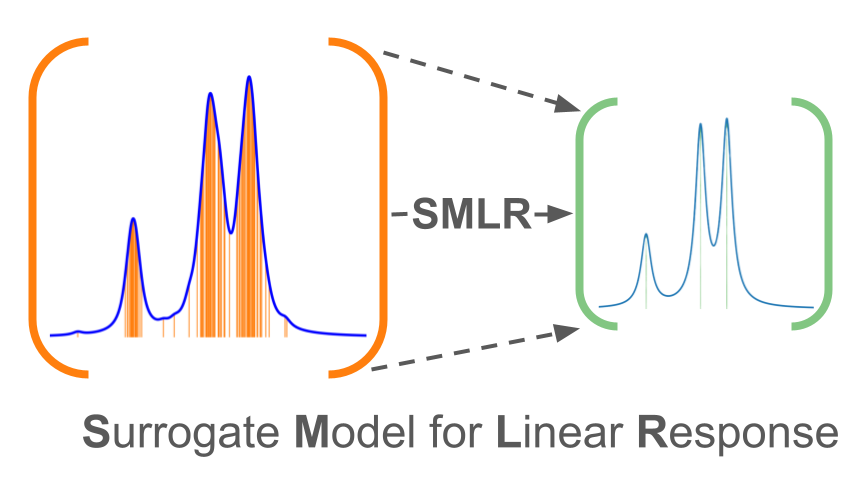
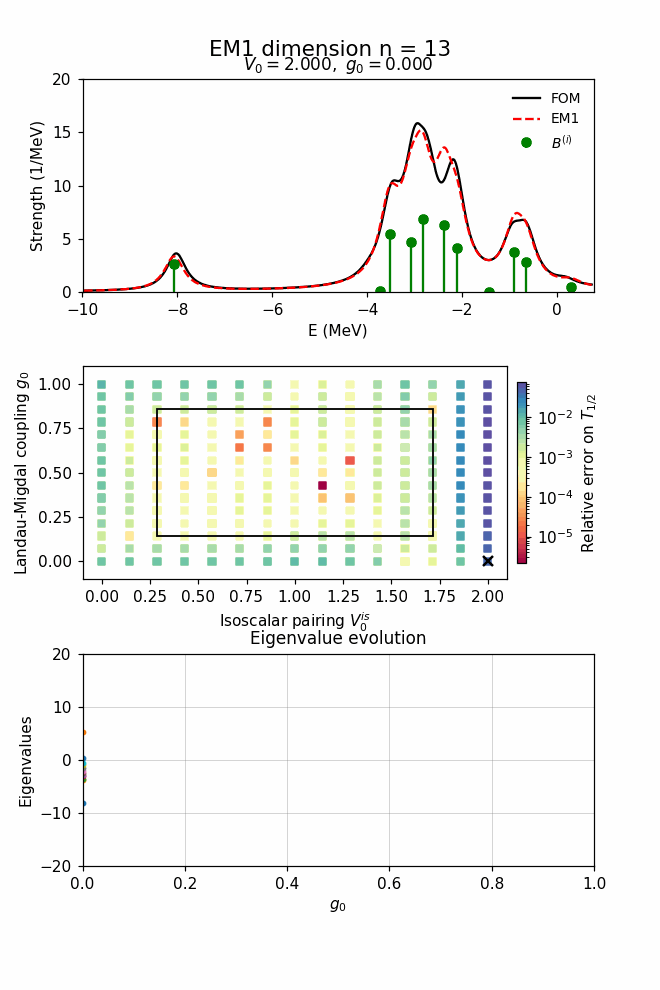
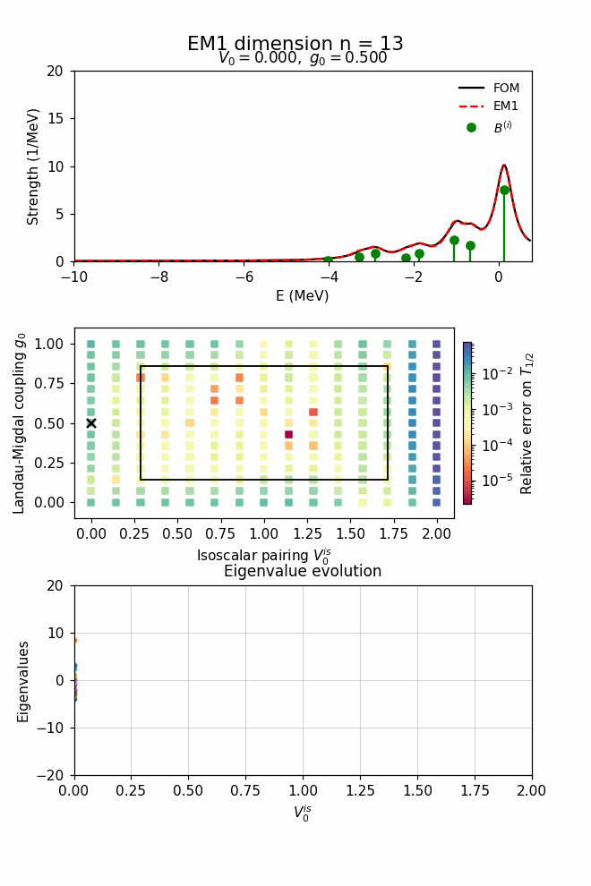

# SMLR: Surrogate Models for Linear Response



This repository accompanies *L. Jin et al., “Surrogate Models for Linear Response”*.  
It provides user-ready **emulators** and **notebooks** for reproducing figures and results.


---

## Repository layout

- **`Dipole_polarizability/`** — Emulators for *like-particle QRPA* (dipole strength & electric dipole polarizability).
- **`Beta_decay/`** — Emulators for *charge-exchange QRPA* (strengths & $\beta$-decay half-lives).
- **`figs/`** — Jupyter notebooks to recreate paper figures.
- **Data (external)** — High-fidelity QRPA inputs expected under:
  - `dipoles_data_all/` (dipole strengths & $\alpha_D$)
  - `beta_decay_data_Ni_80/` (GT strengths & half-lives)

---

## Dipole polarizability

Contains emulators for **dipole strength** and **electric dipole polarizability**.

**Main files**
1. `dipole_main.py` — train **EM1** (strengths + polarizability)  
2. `main_only_alphaD.py` — train **EM2** (polarizability only)  
3. `helper.py` — shared utilities

### Quick start — EM1
```bash
# Fast default — trains $n_1 = 10$ model
python main.py

# Customize model and training knobs
python main.py --n 10 --retain 0.5 --fold 2.0     --num-iter 40000 --print-every 500     --n-restarts 5 --seed0 100     --plots save --save-dir runs_em1
```
More flags: `python main.py --help`

**Outputs (EM1)**
- Per-seed: `runs_dipole/seed_<SEED>/`  
  - `params_n<N>_retain<R>_seed<SEED>.txt`  
  - `cost_history_seed<SEED>.png` / `.pdf`  
  - (optional with `--plots save`) `central_spectrum_fit.png`
- Global (top-level):  
  - `params_best_n<N>_retain<R>.txt` — best parameters across all restarts  
  - `train_set.txt` — list of `(alpha,beta)` grid points used for training

### Quick start — EM2
```bash
# Fast default — trains $n_2 = 9$ model
python main_only_alphaD.py

# Customize
python main_only_alphaD.py --n 9 --n-restarts 5 --seed0 7     --num-iter 40000 --print-every 500     --plots save --save-dir runs_em2
```
More flags: `python dipole_em2_only_alphaD.py --help`

**Outputs (EM2)**
- Per-seed: `runs_dipole_em2/seed_<SEED>/`  
  - `params_n<N>_seed<SEED>.txt`  
  - `cost_history_seed<SEED>.png` / `.pdf`  
  - (optional with `--plots save`) `train_alphaD_compare_iter<K>.png`
- Global (top-level):  
  - `params_<N>_only_alphaD.txt` — best parameters across all restarts  
  - `train_set.txt` — list of parameter grid points used for training

---

## Beta decay

Contains emulators for **charge-exchange QRPA** using the `beta_decay_data_Ni_80/` dataset.

**Main files**
1. `main.py` — train **EM1** (strengths + half-lives)  
2. `main_only_HL.py` — train **EM2** (half-lives only)  
3. `helper.py` — shared utilities

### Quick start — EM1
```bash
# Fast default — trains $n_1 = 8$ model
python main.py

# Customize model and training knobs
python main.py --n 12 --retain 0.85 --num-iter 40000 --print-every 500                --n-restarts 3 --seed0 100 --plots save --save-dir runs_em1
```
More flags: `python main.py --help`

**Outputs (EM1)**
- Per-seed: `runs_em1/seed_<SEED>/`  
  - `params_n<N>_retain<R>_seed<SEED>.txt`  
  - `cost_history_seed<SEED>.png` / `.pdf`  
  - (optional with `--plots save`) training diagnostics PNGs
- Global (top-level):  
  - `params_best_n<N>_retain<R>.txt`  
  - `train_set.txt`

### Quick start — EM2
```bash
# Fast default — trains $n_2 = 9$ model 
python main_only_hl.py

# Customize
python main_only_hl.py --n 9 --n-restarts 4 --seed0 42     --num-iter 40000 --print-every 500     --plots save --save-dir runs_em2
```
More flags: `python main_only_HL.py --help`

**Outputs (EM2)**
- Per-seed: `runs_em2/seed_<SEED>/`  
  - `params_n<N>_seed<SEED>.txt`  
  - `cost_history_seed<SEED>.png` / `.pdf`
- Global (top-level):  
  - `params_<N>_only_HL.txt`  
  - `train_set.txt`

---

## Data

High-fidelity QRPA inputs should be placed at:
- `dipoles_data_all/`  
  - `total_strength/strength_<beta>_<alpha>.out`
  - `total_alphaD/…`
- `beta_decay_data_Ni_80/`  
  - strength files and half-life tables used by the Beta-decay emulators

Adjust paths in the scripts if your dataset is stored elsewhere.

---

## Figures & notebooks

Notebooks in `figs/` reproduce the plots shown in the paper.  
They expect trained parameter files produced by the scripts above.

---

## EM1 in action (example)

Performance of EM1 on the training set, reproducing Gamow–Teller strength in $^{80}$Ni.

Sweep across $g_0$ (fix $V_0^{\mathrm{is}}$):  


Sweep across $V_0^{\mathrm{is}}$ (fix $g_0$):  


---

## Citation

If you use this code, please cite the associated paper and repository:

> L. Jin *et al.*, “Surrogate Models for Linear Response,” 2025.  
> (Add BibTeX entry here.)
