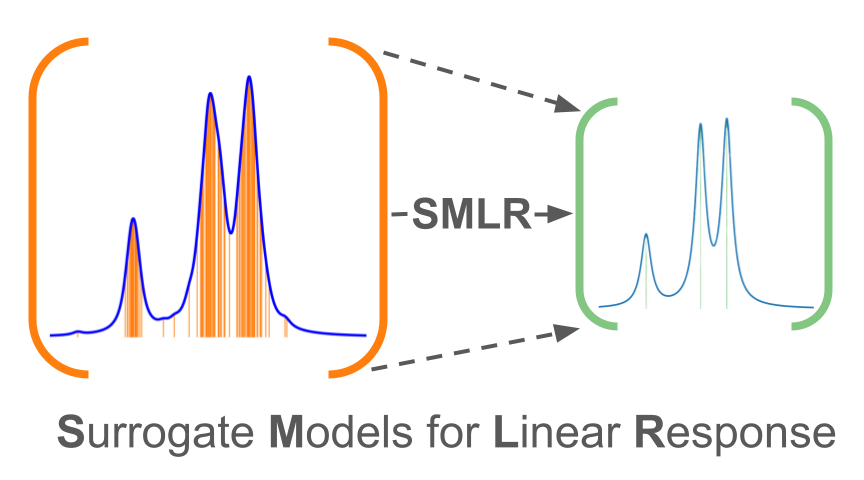

# SMLR: Surrogate Model for Linear Response

This repository contains the code accompanying the paper *L.Jin et al., "Efficient Surrogates for Linear Response Theory"*.

The repository is organized into three main types of folders:

---

## `Dipole_polarizability`

Contains scripts to run the emulator for the **like-particle QRPA**. These scripts read input from the `dipole_data_all` folder containing strength functions and relevant observables.

**Main files:**

1. `main.py` — Main script to train EM1
2. `main_only_alphaD.py` — Main script to train EM2
3. `helper.py` — Helper subroutines used in training and evaluation  

---

## `Beta_decay`

Contains scripts to run the emulator for the **charge-exchange QRPA**. These scripts read input from the `beta_decay_data` folder containing strength functions and beta-decay half-lives.

**Main files:**

1. `main.py` — Main script to train the PMM emulator  
2. `helper.py` — Helper subroutines used in training and evaluation  
3. `check_results.py` — Plots strength functions and beta-decay half-lives in the test set (Fig. 5)  
4. `plot_strength.py` — Produces the "rainbow plot" (Fig. 4)  
5. `CAT_plot.py` — Plots the CAT (Fig. 6)

**Note:** Files with the `_only_Hl.py` suffix correspond to Algorithm 2 described in the paper.

---

## `figs`

---
Contains jupyter notebooks for recreating the figures shown in the paper.

---

## DATA files

Folders which contain the high-fidelity QRPA calculations are stored in `dipoles_data_all` and `beta_decay_data_Ni80`. 

## EM1 in action

Performance of the emulator on the training set, reproducing the Gamow-Teller strength in ${}^{80}$Ni.

